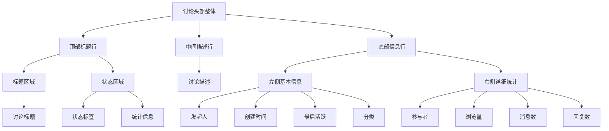

# Discussion Header 重新设计

## 当前问题
- 布局过于拥挤，信息层次不清晰
- stats 与其他信息混在一起，显得杂乱
- 视觉层次不够分明

## 新设计方案

### 布局结构（Mermaid 图表）

### 具体布局说明

#### 1. 顶部标题行
- **标题区域**：左侧显示讨论标题，占主要空间
- **状态区域**：右侧显示状态标签和统计信息
  - 状态标签：进行中/已结束/已归档
  - 统计信息：消息、参与者、浏览、回复（小型图标+数字）

#### 2. 中间描述行
- 讨论描述（如果存在）
- 如果描述过长，显示省略号

#### 3. 底部信息行
- **左侧基本信息**：
  - 发起人
  - 创建时间
  - 最后活跃时间
  - 分类信息
  - 分叉信息（如果存在）
  
- **右侧详细统计**：
  - 参与者数量
  - 浏览量
  - 消息总数
  - 回复总数

### 视觉设计原则

1. **层次分明**：标题最大最重要，其次是描述，最后是详细信息
2. **分组清晰**：相关信息放在一起，用间距和样式区分
3. **视觉引导**：使用颜色、大小、间距引导用户视线
4. **响应式设计**：在小屏幕上适当调整布局

### 颜色方案
- 标题：深色，大字体
- 状态：根据状态显示不同颜色（绿色/灰色/蓝色）
- 统计：适中颜色，简洁样式
- 描述：次要信息，较浅颜色
- 元信息：淡色文字

### 间距设计
- 标题行：充足的上下间距
- 描述行：中等间距
- 信息行：紧凑但清晰
- 统计卡片：统一间距，圆角设计