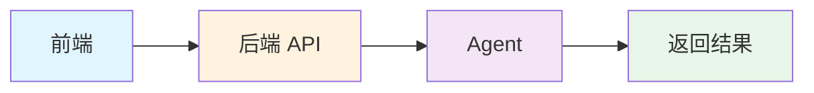
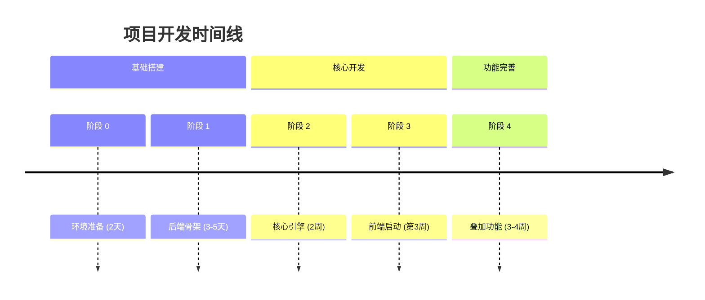

# AI 资讯社交协作平台 - 开发计划

> **文档类型**：开发实施指南  
> **编制日期**：2026-07-13  
> **基于版本**：PRD v2.0

---

## 阶段 0：环境准备（2天）

### 目标
搭建项目基础架构，配置本地开发环境

### 实施步骤

```bash
# 1. 项目初始化
mkdir ai-news-social-agent
cd ai-news-social-agent
poetry init

# 2. 搭建基础目录结构
# 创建 backend/ 核心目录，配置 FastAPI 基础

# 3. 本地开发环境
docker-compose up -d postgres redis qdrant
# 新版用docker compose
```

### 交付物

- [x] 项目目录结构
- [x] Docker Compose 配置文件
- [x] 本地数据库运行中

---

## 阶段 1：后端骨架（3-5天）—— 可运行的最小系统

### 目标
让一个 Hello World 能跑起来，连接数据库

### 第 1 步：FastAPI 基础
参考官方文档链接
https://fastapi.tiangolo.com/tutorial/first-steps/
https://fastapi.tiangolo.com/reference/apirouter/#fastapi.APIRouter


```python
# backend/main.py
from fastapi import FastAPI
from backend.api.routes import health

app = FastAPI(title="AI资讯协作平台")
app.include_router(health.router)

# 启动验证
# uvicorn backend.main:app --reload
# 访问 http://localhost:8000/health → {"status":"ok"}
```

### 第 2 步：数据库连接

```python
# 配置 PostgreSQL + SQLAlchemy
# 创建一个 User 表
# 测试增删改查
```

### 第 3 步：简单认证

```python
# JWT 登录接口
# /api/auth/login → 返回 token
# /api/auth/me → 返回用户信息
```

### 第 4 步：基础 API 骨架

```python
# 定义空路由（返回占位数据）
# /api/chat → {"message": "TODO"}
# /api/social → {"message": "TODO"}
# /api/knowledge → {"message": "TODO"}
```

### 阶段 1 交付物

- [x] FastAPI 服务可运行
- [x] PostgreSQL 连接成功
- [x] JWT 登录/注册可用
- [x] API 路由骨架完整
- [x] 单元测试 2-3 个

### 启动方式

```bash
make up          # docker-compose up
make migrate     # 建表
make dev         # uvicorn --reload
```

---

## 阶段 2：核心引擎（2周）—— Agent 能跑起来

### 目标
LangGraph Agent 能完成一次完整的搜索

### 第 1 步：State + 图构建（3天）

```python
# backend/core/state.py
class AgentState(TypedDict):
    messages: List[BaseMessage]
    search_results: List[dict]
    iteration_count: int
    is_complete: bool
```

```python
# backend/core/graph_builder.py
def build_agent_graph():
    builder = StateGraph(AgentState)
    builder.add_node("agent", agent_node)
    builder.add_node("tools", tools_node)
    # ... 简单 2 个节点 + 条件边
    return builder.compile()
```

### 第 2 步：LLM + 工具集成（3天）

```python
# backend/capabilities/llm/factory.py
def get_model():
    return ChatOpenAI(model="gpt-4o-mini")
```

```python
# backend/capabilities/tools/tavily.py
@tool
def search_ai_news(query: str) -> str:
    tavily = TavilySearchResults(max_results=5)
    return tavily.invoke(query)
```

### 第 3 步：首次 Agent Loop 成功（3天）

```python
# 测试脚本
# demos/01_basic_agent_loop.py
graph.invoke({
    "messages": [HumanMessage(content="AI融资新闻")],
    "search_results": [],
    "iteration_count": 0
})
# ✅ 能看到返回 5 条结果
```

### 第 4 步：集成到 API（2天）

```python
# backend/api/routes/chat.py
@router.post("/search")
async def search(request: ChatRequest):
    result = graph.invoke(...)
    return {"answer": result["messages"][-1].content}
```

### 阶段 2 交付物

- [x] LangGraph 图可运行
- [x] Tavily 搜索成功
- [x] Agent Loop 完整执行
- [x] API /search 可调用
- [x] 日志记录功能

---

## 阶段 3：前端同步启动（第 3 周开始）

### 目标
前端界面出现，能调用后端 API

### 第 1 步：前端项目初始化（2天）

```bash
# frontend/
pnpm create vite
pnpm install axios antd reactflow
```

### 第 2 步：简单界面（3天）

```tsx
// 一个输入框 + 一个按钮
// 输入问题 → 调用 /search API → 显示结果
// 粗糙但能用
```

### 第 3 步：联调优化（3天）



> **验证目标**：用户能完整走通 "提问-搜索-看结果" 流程

### 阶段 3 交付物

- [x] 前端项目跑起来
- [x] 调用后端 /search 成功
- [x] 展示搜索结果
- [x] 基本 UI 框架

---

## 阶段 4：逐层叠加功能（3-4周）

> **策略**：按优先级逐个添加功能，每个功能独立测试后上线

### 功能排期表

| 优先级 | 功能 | 时间 | 验收标准 |
|--------|------|------|----------|
| P0 | WebSocket 实时推送 | 3 天 | Agent 执行过程前端实时展示 |
| P0 | 人工审核（interrupt）| 2 天 | 管理员可中断/批准 |
| P0 | 检查点保存 | 2 天 | 状态保存到数据库 |
| P1 | RAG 知识库 | 4 天 | 文档入库+检索问答 |
| P1 | 群组讨论 | 3 天 | 发布/评论/投票 |
| P1 | 检查点管理（分叉/重放）| 3 天 | 界面可操作 |
| P2 | 多 Agent 辩论 | 3 天 | 三方观点展示 |
| P2 | 话题归档 | 2 天 | 自动打标签 |

### 开发流程示意

```mermaid
gantt
    title 阶段 4 功能开发时间线
    dateFormat X
    axisFormat %s
    
    section P0 核心功能
    WebSocket 实时推送     :p0_1, 0, 3
    人工审核 interrupt      :p0_2, 3, 5
    检查点保存             :p0_3, 5, 7
    
    section P1 重要功能
    RAG 知识库             :p1_1, 7, 11
    群组讨论               :p1_2, 11, 14
    检查点管理             :p1_3, 14, 17
    
    section P2 增强功能
    多 Agent 辩论          :p2_1, 17, 20
    话题归档               :p2_2, 20, 22
```



---

## 开发里程碑总览



---

## 技术栈清单

### 后端技术栈

| 技术 | 版本 | 用途 |
|------|------|------|
| Python | 3.10+ | 主要开发语言 |
| FastAPI | 0.100+ | Web 框架 |
| LangGraph | 最新版 | Agent 编排 |
| LangChain | 最新版 | LLM 集成 |
| PostgreSQL | 15+ | 主数据库 |
| Qdrant | 最新版 | 向量数据库 |
| Redis | 7+ | 缓存/消息队列 |
| Celery | 5.3+ | 异步任务 |

### 前端技术栈

| 技术 | 版本 | 用途 |
|------|------|------|
| React | 18+ | UI 框架 |
| TypeScript | 5+ | 类型安全 |
| Ant Design | 5+ | UI 组件库 |
| ReactFlow | 最新版 | 流程图可视化 |
| Axios | 1.x | HTTP 请求 |
| Vite | 5+ | 构建工具 |

---

## 目录结构建议

```
ai-news-social-agent/
├── backend/
│   ├── main.py                 # FastAPI 入口
│   ├── core/                   # 核心模块
│   │   ├── state.py           # Agent State 定义
│   │   └── graph_builder.py   # 图构建器
│   ├── api/                    # API 路由
│   │   └── routes/
│   │       ├── auth.py        # 认证接口
│   │       ├── chat.py        # 对话接口
│   │       ├── social.py      # 社交接口
│   │       └── knowledge.py   # 知识库接口
│   ├── capabilities/           # 能力层
│   │   ├── llm/              # LLM 相关
│   │   │   └── factory.py    # 模型工厂
│   │   └── tools/            # 工具集
│   │       └── tavily.py     # Tavily 搜索
│   └── models/                # 数据模型
├── frontend/
│   ├── src/
│   │   ├── components/        # 组件
│   │   ├── pages/            # 页面
│   │   └── api/              # API 调用
│   └── package.json
├── demos/                      # 测试演示脚本
├── docker-compose.yml
├── Makefile
└── README.md
```

---

## 常用命令速查

```bash
# 开发环境启动
make up          # 启动 Docker 服务
make migrate     # 数据库迁移
make dev         # 启动开发服务器

# 测试
pytest tests/    # 运行测试

# 代码质量
black .          # 代码格式化
flake8 .         # 代码检查
```

---

## 注意事项

### 开发原则

1. **渐进式开发**：每个阶段都要有可运行的产物
2. **测试先行**：核心逻辑必须覆盖单元测试
3. **日志完备**：Agent 执行过程全程记录
4. **错误友好**：API 返回清晰的错误信息

### 常见问题

<details>
<summary><b>🔧 环境搭建问题</b></summary>

**Q: Docker 服务启动失败？**
```bash
# 检查端口占用
lsof -i :5432  # PostgreSQL
lsof -i :6379  # Redis
lsof -i :6333  # Qdrant

# 重启 Docker 服务
docker-compose down && docker-compose up -d
```

</details>

<details>
<summary><b>⚡ Agent 执行问题</b></summary>

**Q: Tavily API 调用失败？**
- 检查 API Key 是否正确配置
- 确认账户余额充足
- 查看网络代理设置

**Q: LangGraph 图执行卡住？**
- 检查 iteration_count 是否超过上限
- 查看 Agent 日志确认决策节点状态
- 验证工具返回数据格式

</details>

---

*文档结束*
