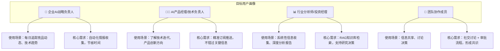
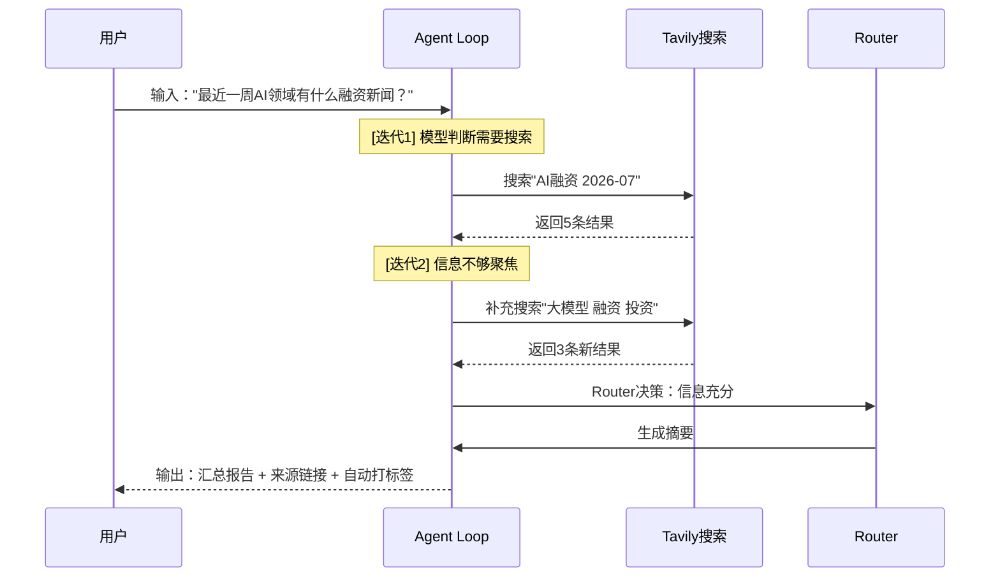
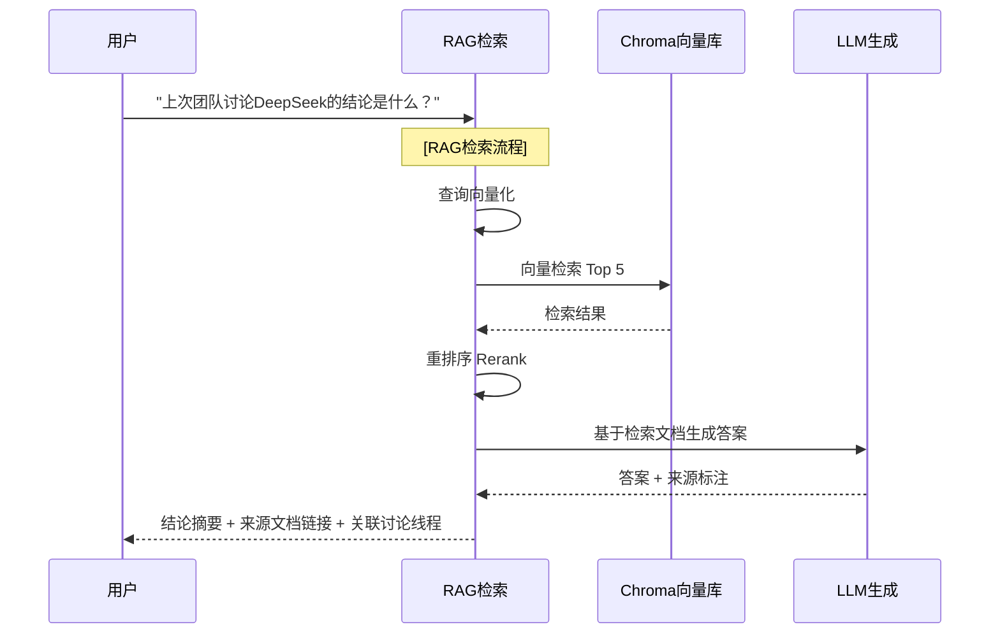
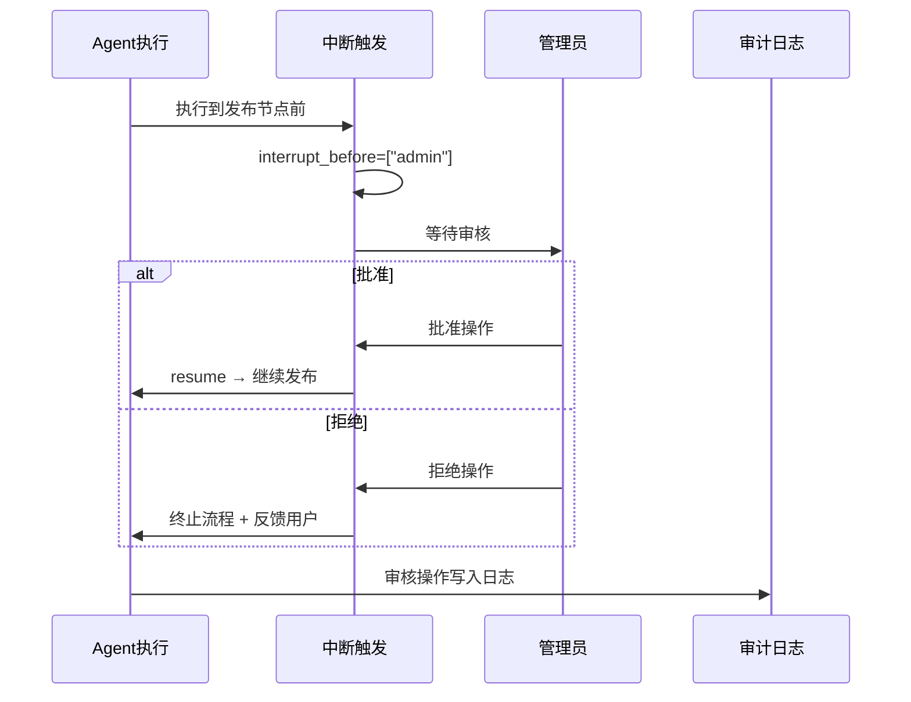
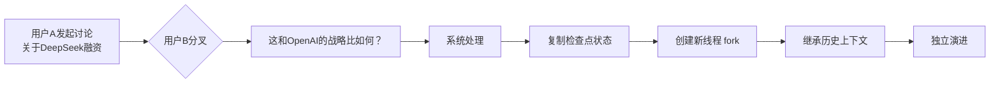
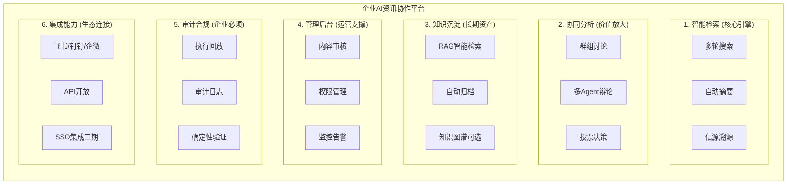
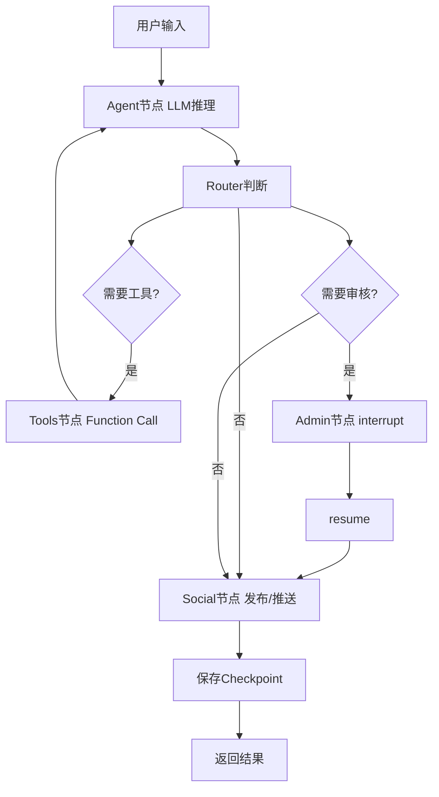
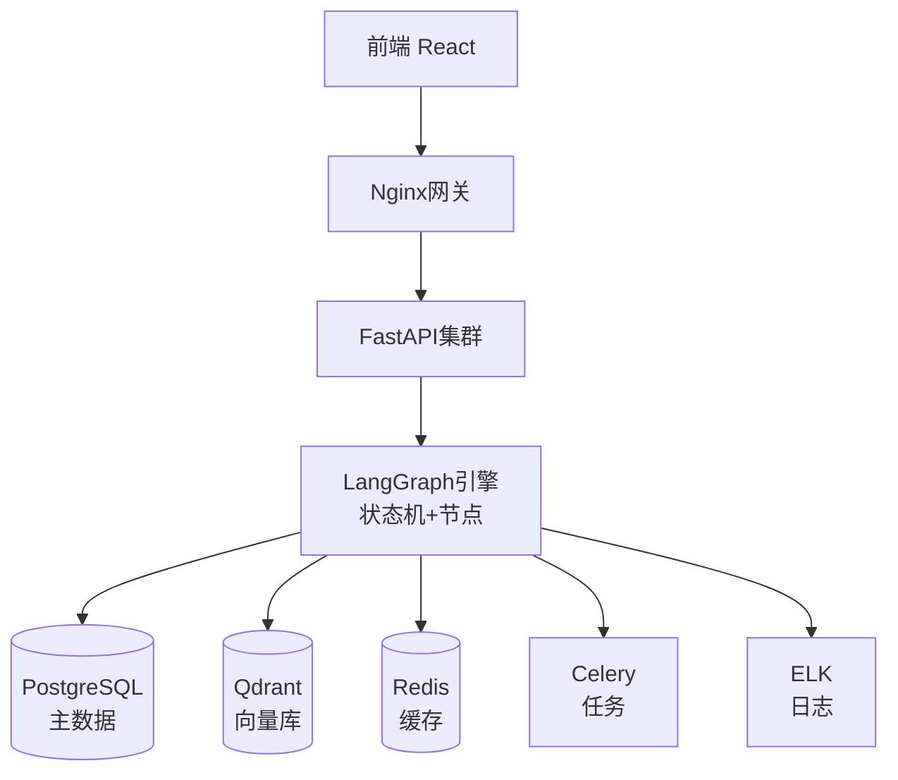

# AI 资讯社交协作平台

> **文档版本**：v2.0（企业生产版）  
> **编制日期**：2026-07-12  
> **文档状态**：正式版

---

## 一、文档信息与元数据

| 字段 | 内容 |
|------|------|
| PRD ID | PRD-20260712-AI-SOCIAL-001 |
| 产品名称 | AI 资讯社交协作平台 |
| 文档版本 | v2.0 |
| 文档状态 | ✅ 已批准 |
| 作者 | 产品团队 |
| 技术负责人 | 架构团队 |
| 审批人 | 产品总监 / CTO |

### 利益相关者

- **产品团队**：需求定义、优先级排序
- **设计团队**：交互设计、UI视觉
- **开发团队**：前后端实现、AI集成
- **算法团队**：LangGraph编排、模型调优
- **运维团队**：部署、监控、稳定性
- **合规团队**：数据安全、审计要求

### 版本历史

| 版本 | 日期 | 变更说明 | 作者 |
|------|------|----------|------|
| v0.1 | 2026-07-01 | 初始草案（技术验证版） | 产品团队 |
| v1.0 | 2026-07-02 | 增加社交功能完整方案 | 产品团队 |
| v2.0 | 2026-07-12 | 企业生产级重构，精简优化 | 产品团队 |

---

## 二、产品概述

### 2.1 产品定位

本产品是一款面向企业AI部门/科技媒体/投资机构的智能资讯协作平台，以 **"AI 赋能信息获取，协作沉淀知识资产"** 为核心定位。

产品深度融合：

- **生成式AI**：Agent智能检索与多轮推理
- **RAG技术**：知识库检索增强问答
- **协同工作流**：群组讨论、审核流程、知识沉淀

### 2.2 核心价值主张

| 价值维度 | 具体描述 | 可量化目标 |
|----------|----------|------------|
| 提效 | AI自动完成80%资讯筛选工作 | 节省团队2小时/人/天 |
| 准确 | 多源验证 + 人工审核机制 | 信息准确率 > 95% |
| 沉淀 | RAG知识库永久归档优质内容 | 月均新增100+高质量文档 |
| 合规 | 完整审计追踪 + 确定性重放 | 满足企业内部审计要求 |

### 2.3 目标用户

### 2.4 产品范围

#### ✅ 包含功能

- [x] AI智能资讯检索（多轮Agent Loop）
- [x] RAG知识库（文档入库 + 检索增强）
- [x] 执行链路可视化（节点流转、日志追踪）
- [x] 群组协作与讨论（发布、评论、投票）
- [x] 人工审核与干预（interrupt + resume）
- [x] 检查点管理与重放（审计、合规）
- [x] 企业级认证与权限（JWT + RBAC）

#### ❌ 不包含（本期）

- [ ] 移动端APP（仅Web端）
- [ ] 实时音视频通话
- [ ] 付费订阅与计费系统
- [ ] 第三方SSO集成（二期规划）

---

## 三、用户需求与典型场景

### 3.1 用户故事地图

| 角色 | 场景 | 痛点 | 解决方案 | 期望AI能力 |
|------|------|------|----------|------------|
| 战略负责人 | 每日情报收集 | 信息太分散，筛选成本高 | Agent自动搜索 + 智能摘要 | 检索、总结、推送 |
| 技术负责人 | 技术动态追踪 | 迭代太快，怕错过关键信息 | 订阅 + 精准触达 | 分类、过滤、推荐 |
| 分析师 | 深度研究报告 | 信息碎片化，无法系统化 | RAG知识库检索 | 检索、问答、关联 |
| 团队协作 | 信息共享与决策 | 沟通成本高，难以达成共识 | 群组讨论 + 投票决策 | 多角度分析 |

### 3.2 核心使用场景

#### 场景一：日常资讯检索

#### 场景二：RAG知识库问答

#### 场景三：人工审核与干预

#### 场景四：分叉讨论

---

## 四、AI 价值点与可行性分析

### 4.1 AI使用场景与价值

| AI能力 | 使用场景 | 预期收益 | 可行性 |
|--------|----------|----------|--------|
| Agent多轮检索 | 资讯搜索，信息补全 | 节省80%筛选时间 | ✅ 可行（LangGraph）|
| 智能摘要生成 | 检索结果汇总 | 快速获取关键信息 | ✅ 可行（LLM）|
| 话题自动归档 | 内容分类打标签 | 知识有序化 | ✅ 可行（规则+LLM）|
| RAG检索增强 | 历史知识问答 | 知识复用，降低重复劳动 | ✅ 可行（Qdrant）|
| 多Agent辩论 | 多角度分析 | 决策更全面 | ⚠️ 需评估成本 |
| 确定性重放 | 审计验证 | 满足合规要求 | ✅ 可行（Checkpointer）|

### 4.2 技术可行性判断

| 技术点 | 成熟度 | 风险 | 应对策略 |
|--------|--------|------|----------|
| LangGraph状态机 | ⭐⭐⭐⭐⭐ | 低 | 官方稳定API |
| Function Calling | ⭐⭐⭐⭐⭐ | 低 | 主流模型均支持 |
| RAG向量检索 | ⭐⭐⭐⭐⭐ | 中 | 需优化检索精度 |
| 检查点持久化 | ⭐⭐⭐⭐ | 中 | 需设计数据库存储 |
| WebSocket实时推送 | ⭐⭐⭐⭐⭐ | 低 | 成熟技术 |

### 4.3 量化成功指标

| 指标 | 目标值 | 测量方式 |
|------|--------|----------|
| 检索准确率 | > 85% | 人工抽检 |
| Agent平均迭代次数 | < 3轮 | 系统日志统计 |
| 检索响应时间 | < 15秒 | 系统监控 |
| RAG检索命中率 | > 70% | 用户反馈 + 日志 |
| 用户留存率（月）| > 60% | 运营数据分析 |
| 日均活跃用户 | > 30人 | 系统统计 |

---

## 五、功能需求

### 5.1 模块总览

### 5.2 模块一：智能检索

#### 5.2.1 Agent多轮检索

**需求描述**：  
用户输入问题后，AI Agent自主决策是否需要搜索、搜索什么、何时结束并生成答案。

**功能要求**：

- 接收自然语言查询
- 系统提示词引导决策（搜索/结束）
- 调用搜索工具（Tavily API）
- 评估结果完整性
- 支持最多5轮迭代
- 每轮状态记录共享State

**验收标准**：

- 30秒内返回最终答案
- 迭代轮次界面实时显示
- 每轮搜索结果可追溯

#### 5.2.2 工具调用（Function Calling）

**功能要求**：

- 搜索工具包含清晰描述和参数
- 返回结构化结果（标题、摘要、链接、发布时间）
- 多轮结果累积合并
- 工具调用日志完整记录

**验收标准**：

- 搜索记录在界面完整展示
- 结果含3-5条有效资讯
- 支持中英文混合搜索

#### 5.2.3 监督者模式

**功能要求**：

- 监督者节点分析任务复杂度
- 动态拆解分配给子Agent
- 子Agent可并行或串行执行
- 监督者汇总输出

**验收标准**：

- 支持2-3个子Agent协同
- 任务拆解过程可视化
- 汇总结果含多角度观点

### 5.3 模块二：协同分析

#### 5.3.1 群组发布与推送

**功能要求**：

- 资讯摘要自动发布到群组
- 自动打话题标签
- 推送订阅用户
- 支持评论和回复

**验收标准**：

- 发布内容含摘要、来源、标签
- 订阅用户收到推送通知
- 支持消息内交互

#### 5.3.2 讨论分叉（Fork）

**功能要求**：

- 展示检查点历史列表
- 用户选择检查点创建分叉
- 新线程继承原状态
- 分叉关系可追溯

**验收标准**：

- 分叉操作≤3步
- 分叉后保留上下文
- 关系在界面可视化

#### 5.3.3 AI多角色辩论

**功能要求**：

- 监督者拆解任务给3个子Agent
- 各Agent独立生成论证
- 汇总展示多方观点
- 支持投票和评论

**验收标准**：

- 每个Agent≥3条论据
- 观点清晰区分立场
- 投票实时更新

### 5.4 模块三：知识沉淀

#### 5.4.1 话题自动归档

**功能要求**：

- 自动提取1-3个话题标签
- 归档到对应话题空间
- 支持手动修正标签
- 话题空间展示归档内容

**验收标准**：

- 标签提取准确率>80%
- 归档含完整对话上下文
- 支持按标签检索

#### 5.4.2 RAG知识库

**功能要求**：

- **文档入库**：分块、向量化、存储
- **检索**：查询→向量检索→重排→生成
- 支持外部文档上传
- 检索来源可追溯

**验收标准**：

- 检索命中率>70%
- 支持PDF/Markdown/TXT
- 结果含来源引用

### 5.5 模块四：管理后台

#### 5.5.1 人工审核

**功能要求**：

- 审核节点自动中断
- 管理员可批准或拒绝
- 批准后resume继续
- 拒绝后终止并通知

**验收标准**：

- 中断界面提示等待审核
- 审核操作≤1分钟
- 审核记录写入日志

#### 5.5.2 检查点管理

**功能要求**：

- 展示检查点列表
- 从检查点恢复执行
- 从检查点分叉新线程
- 导出检查点快照

**验收标准**：

- 列表按时间排序
- 恢复后状态正确
- 快照导出为JSON

#### 5.5.3 确定性重放

**功能要求**：

- 选择检查点
- 重新执行完整流程
- 执行过程可视化
- 对比原始和重放结果

**验收标准**：

- 重放结果与原始一致
- 重放过程实时展示
- 重放耗时记录

### 5.6 模块五：认证与权限

#### 5.6.1 用户认证（JWT）

**功能要求**：

- 用户注册/登录
- JWT Token颁发
- Token自动刷新
- 密码加密存储

#### 5.6.2 权限控制（RBAC）

| 角色 | 权限范围 |
|------|----------|
| 管理员 | 全部权限 |
| 管理者 | 查看、创建、审核、审计 |
| 分析师 | 查看、创建 |
| 普通成员 | 查看 |
| 访客 | 仅查看公开内容 |

---

## 六、数据需求

### 6.1 核心数据实体

| 实体 | 存储位置 | 关键字段 |
|------|----------|----------|
| 用户 | PostgreSQL | id, username, email, role, groups |
| 线程 | PostgreSQL | thread_id, user_id, status, tags |
| 消息 | PostgreSQL | thread_id, role, content, iteration |
| 检查点 | PostgreSQL | checkpoint_id, thread_id, state_snapshot |
| 文档 | PostgreSQL + Qdrant | doc_id, content, embedding, tags |
| 帖子 | PostgreSQL | thread_id, user_id, group_id, content |
| 审计日志 | PostgreSQL + ELK | timestamp, user_id, event_type, data |

### 6.2 数据规模预估（100人团队）

| 数据 | 日增 | 月增 | 年规模 |
|------|------|------|--------|
| 消息 | 500条 | 1.5万条 | 18万条 |
| 检查点 | 50个 | 1500个 | 1.8万个 |
| 搜索记录 | 100条 | 3000条 | 3.6万条 |
| 文档 | 5篇 | 150篇 | 1800篇 |
| 审计日志 | 1000条 | 3万条 | 36万条 |

### 6.3 数据合规要求

- **用户数据**：符合GDPR，支持删除
- **审计日志**：保留7年，不可变
- **对话记录**：永久归档
- **检查点快照**：保留30天

---

## 七、非功能需求

### 7.1 性能要求

| 指标 | 目标值 |
|------|--------|
| Agent首轮响应 | < 5秒 |
| 完整执行（3轮）| < 30秒 |
| 检查点保存 | < 100ms |
| 向量检索 | < 500ms |
| WebSocket延迟 | < 200ms |
| 并发用户 | ≥ 100人 |

### 7.2 可用性

- 系统可用性 ≥ 99.5%
- 检查点每日自动备份
- 故障恢复 < 5分钟

### 7.3 安全性

- API请求需JWT认证
- 数据按user_id隔离
- 敏感内容审核后发布
- 审计日志append-only

### 7.4 可扩展性

- 支持切换LLM模型
- 支持添加新工具
- 支持添加新节点
- 向量库支持横向扩展

---

## 八、系统流程设计

### 8.1 整体执行流程

### 8.2 状态机设计

**State定义**：

| 字段 | 类型 | 说明 |
|------|------|------|
| messages | list | 对话历史 |
| user_query | str | 当前查询 |
| iteration_count | int | 迭代轮次 |
| search_results | list | 累积搜索结果 |
| is_complete | bool | 完成标识 |
| tags | list | 话题标签 |
| is_approved | bool | 审核状态 |

### 8.3 异常处理

| 异常 | 处理策略 |
|------|----------|
| API超时 | 重试3次，降级返回部分结果 |
| 模型返回异常 | 回退到上一检查点 |
| 无搜索结果 | 提示用户调整关键词 |
| 审核超时 | 自动拒绝 + 通知管理员 |

---

## 九、技术架构概述

### 9.1 技术栈总览

| 层级 | 技术选型 | 用途 |
|------|----------|------|
| 前端 | React 18 + TypeScript + Ant Design | 用户界面 |
| 可视化 | ReactFlow + ECharts | 流程图、图表 |
| Web框架 | FastAPI | API服务 |
| AI编排 | LangGraph + LangChain | Agent引擎 |
| 数据库 | PostgreSQL | 主数据存储 |
| 向量库 | Qdrant | RAG向量检索 |
| 缓存 | Redis | 缓存 + 消息队列 |
| 异步任务 | Celery | 耗时任务 |
| 部署 | Docker + K8s | 容器化编排 |
| 监控 | Prometheus + ELK | 可观测性 |

### 9.2 服务架构图

---

## 十、风控与合规机制

### 10.1 内容风控

| 风险类型 | 防控措施 |
|----------|----------|
| 虚假信息 | 多源验证 + 人工审核 |
| 敏感内容 | 关键词过滤 + 审核节点 |
| 偏见歧视 | 提示词约束 + 人工复核 |
| 隐私泄露 | 数据脱敏 + 权限隔离 |

### 10.2 技术兜底策略

- **置信度阈值**：模型输出置信度<80%时触发人工审核
- **异常回退**：检测到异常输出时回退到检查点
- **限流熔断**：API调用量超限时自动降级
- **审计全记录**：所有操作可追溯

---

## 十一、项目排期与版本规划

### 11.1 开发里程碑

| 阶段 | 周期 | 交付内容 |
|------|------|----------|
| M1: 架构设计 | 第1周 | 架构文档、数据库设计、API设计 |
| M2: 核心引擎 | 第2-3周 | LangGraph图构建、节点实现 |
| M3: 工具与LLM | 第3-4周 | Tavily搜索、模型工厂 |
| M4: 社交与RAG | 第5-6周 | 群组、分叉、向量检索 |
| M5: 前端开发 | 第6-8周 | React页面、可视化 |
| M6: 管理后台 | 第8-9周 | 审核、检查点、日志 |
| M7: 测试部署 | 第9-10周 | 测试、Docker、K8s配置 |

### 11.2 版本规划

| 版本 | 周期 | 核心能力 |
|------|------|----------|
| V1.0 MVP | 10周 | Agent检索 + 人工审核 + 基础社交 |
| V1.1 | 3周 | RAG知识库 + 话题归档 |
| V1.2 | 3周 | Multi-Agent辩论 + 分叉讨论 |
| V2.0 | 6周 | SSO集成 + 企业IM对接 + 性能优化 |

---

## 十二、附录

### 附录A：术语表

| 术语 | 定义 |
|------|------|
| Agent | 基于LLM的智能体，自主决策和调用工具 |
| Agent Loop | Agent循环执行推理-行动-评估的迭代 |
| Checkpoint | 图执行过程中的状态快照 |
| Fork | 从检查点创建新的执行线程 |
| Interrupt | 图执行中的人工介入中断 |
| RAG | 检索增强生成，先检索知识库再生成 |
| Supervisor | 监督者，负责任务拆解和Agent调度 |

### 附录B：知识点-功能映射

| 知识点 | 对应功能 |
|--------|----------|
| LangGraph状态机 | Agent Loop整体架构 |
| Node/Edge/Command | 节点流转、路由决策 |
| Function Calling | Tavily搜索工具 |
| Checkpointer | 检查点管理 |
| interrupt/resume | 人工审核 |
| Fork历史 | 分叉讨论 |
| 确定性重放 | 审计回放 |
| RAG+向量存储 | 知识库检索 |
| 话题归档 | 自动分类 |
| 监督者模式 | Multi-Agent辩论 |
| 审计日志 | 执行链路追踪 |

### 文档审批

| 角色 | 姓名 | 日期 | 签字 |
|------|------|------|------|
| 产品经理 | | | |
| 技术负责人 | | | |
| 合规负责人 | | | |

---

*文档结束*
